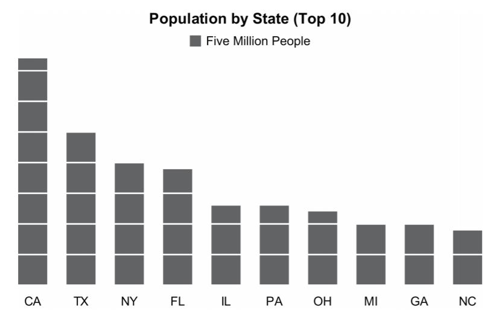

# Data Visualization:
-----------------
## Unit Chart
### I- Définitions et concept:
Un diagramme est une représentation visuelle simplifiée et structurée des concepts, des idées, des constructions, des relations, des données statistiques, de l'anatomie etc. employé dans tous les aspects des activités humaines pour visualiser et éclaircir la matière. Un diagramme permet aussi de décrire des phénomènes, de mettre en évidence des corrélations en certains facteurs ou de représenter des parties d’un ensemble.

Selon <b> Robert L. Harris </b> dans l'information graphique: Une référence illustrée complète, un diagramme d'unité est défini comme suit:

<b> Un diagramme </b> utilisé pour communiquer des quantités de choses en faisant le nombre de symboles sur la carte proportionnelle à la quantité de choses représentées. Par exemple, si un symbole représente dix voitures et cinq symboles sont montrés, le spectateur mentalement multiplie dix fois cinq et conclut que le groupe de symboles représentait 50 voitures réelles. Formes géométriques simples ou formes irrégulières telles que les images et les icônes sont généralement utilisées. Chacun fournit essentiellement le même degré de précision. Quand les symboles sont des formes géométriques, le graphique est parfois appelé un tableau noir. Quand des images, des croquis, ou des icônes sont utilisées, le tableau est souvent appelé un tableau d'unité picturale. Les cartes unitaires sont utilisées presque exclusivement dans des présentations et des publications telles que des journaux, des magazines et des publicités.

<b>Le diagramme</b> est une présentation ou une description écrite de certaines parties régulières et ordinaires de la circulation. Un graphique est propice à la communication et de la concentration et offre des références pour la réingénierie des processus.

<table border="0">
  <tr>
    <td>
      
    </td>
  </tr>
</table>

<table border="0">
  <tr>
    <td>
    <strong>Source:</strong> E. J. Fox, extrait d'une plus grande infographie intitulée «# 1 Party School», basé sur les données de “The Partnership Campus & Community United Against Dangerous Drinking Annual Assessment Report 08-09”
 </td>
  </tr>
</table>

Dans l'exemple ci-dessus, une matrice de points 10x10 avec un élément manquant, totalisant 99, a été utilisée pour afficher habitudes de consommation autodéclarées. Chaque point représente 1% sur 100% des élèves. Bien que les chiffres totalisent 100% exactement, le designer a choisi d'ignorer les décimales dans tous les cas sauf "Heavy Drinker", qu'il a arrondi de 6,9% à 7%. Si le concepteur avait arrondi tous les nombres vers le haut ou le bas, selon le cas, le nombre de points aurait totalisé 100.

### I- La forme d'un diagramme d'unités:
La forme la plus simple d'un diagramme unitaire affiche une seule ligne ou colonne d'unités, plutôt qu'une matrice des deux comme nous l'avons vu dans l'exemple précédent. Comme vous pouvez le voir, un diagramme unidimensionnel est plus simple à lire qu'une version bidimensionnelle.
<table border="0">
  <tr>
    <td>
      
    </td>
  </tr>
</table>

 Compte tenu de la facilité d'utilisation, les cartes unitaires à une dimension en valent-elles la peine? Nous pouvons les lire en lisant les graphiques à barres, avec une différence mineure: la segmentation des valeurs en unités nous incite à ralentir et à compter, contrairement à la tâche plus simple et plus rapide de comparer leurs hauteurs globales et de décoder leurs valeurs. à une échelle quantitative, qui manque. Pas un gros problème, certains pourraient argumenter, mais significatif assez pour décourager leur utilisation lorsque de meilleurs moyens sont disponibles. Cet exemple illustre la pratique courante consistant à inclure des unités partielles - dans ce cas, des rectangles de moins de hauteur qu'une unité complète - pour représenter des quantités partielles.
Par exemple, dans ce graphique, les populations d'états ont été arrondies au million de personnes hauteurs de ces rectangles supérieurs qui représentent moins de cinq millions de personnes.
Comme Harris l'a souligné dans sa définition, les graphiques unitaires sont de deux types: ceux qui utilisent des formes géométriques
tels que des rectangles ou des cercles, et ceux qui utilisent des formes irrégulières telles que des images ou des icônes. Voici un exemple de ce dernier:

<table border="0">
  <tr>
    <td>
     
 </td>
  </tr>
</table>

Cette icône simple qui représente une ou plusieurs personnes (dans ce cas 1 million) est un élément de base de l'infographie. Bien que, en utilisant cette icône familière, le lecteur soit instantanément compris dans le fait que les gens sont l'objet de l'affichage, les valeurs ne peuvent pas être discernées sans compter les icônes ou plus simplement en lisant les nombres (par exemple, 54 millions non assurés). Parce que nous ne pouvons pas comparer au préalable des nombres dépassant trois des quatre objets au maximum, nous sommes obligés d'abandonner la perception visuelle rapide et de compter sur des méthodes plus lentes de discernement-comptage ou de lecture.

## Sources:
[1] - https://www.perceptualedge.com/articles/visual_business_intelligence/unit_charts_are_for_kids.pdf

[2] - 
